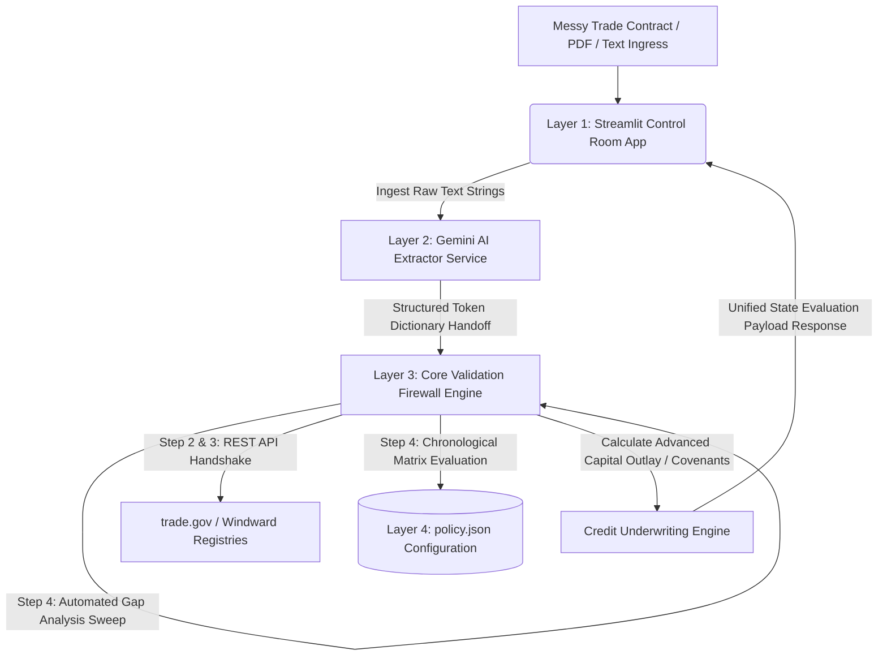

# black-onyx-matrix
# Engineering Notes: Enterprise Risk-Monitoring Middleware
### System Framework: Black Onyx Matrix Control Room

## 1. System Architecture & Component Separation
To maintain enterprise compliance, eliminate non-deterministic AI risk, and ensure absolute testability, this application strictly segregates the presentation layer from the underlying business logic, mathematical matrices, and governing agency rules.

*   **Presentation Layer (App Root / `app.py`):** Pure Streamlit implementation. Responsible *only* for rendering dashboards, state machine ledgers, interactive dropdown profiles, file uploading widgets, and server-to-server webhook simulations. No raw calculations or direct registry API executions happen here.
*   **Ingestion Service Layer (`ai_extractor.py`):** Dedicated unstructured data translation layer. It leverages the Google Gemini 1.5 Flash API natively to parse messy trade contract text arrays or binary PDF layers using `pypdf`, outputting a clean token dictionary schema. It does not judge risk or enforce policy boundaries.
*   **Middleware / Business Logic Layer (`core_engine.py`):** The mathematical firewall of the gateway. It handles strict Pydantic type-checking validation, executes REST API handshakes with regulatory databases (trade.gov, Windward), runs the 7-Step Chronological Escrow Matrix, and evaluates credit underwriting formulas independently of Streamlit.
*   **Data Access & Configuration Layer (`policy.json`):** A decoupled, text-based JSON parameters table managed by the AI Compliance Officer. This stores active risk ceilings, operators, and point penalties, allowing modifications to corporate risk profiles without touching a single line of core Python code.

### Data Flow Topology

## 2. Session Governance & State Management
Streamlit reruns the entire execution script from top to bottom upon any user interaction. To prevent data corruption, state resetting, unnecessary token usage, and unauthorized memory access, application memory is governed under strict criteria:
*   **State Initialization:** Core state parameters, including user verification triggers (`st.session_state.authenticated`) and active ledger states (`st.session_state.trade_ledger`), are explicitly initialized before any layout configurations or widgets are drawn to the screen.
*   **Immutability:** Extracted data payloads are locked into cache states (`st.session_state.ad_hoc_cache`) during real-time evaluations to guarantee that sidebar configuration changes or slider adjustments do not trigger redundant AI API requests or modify historical audit logs.

## 3. Integration Points & Boundaries

### 3.1 Data Pipelines & Injection Points
*   **Multi-Channel File Ingestion:** Supports un-authenticated one-time secure workspace tokens for public supplier drop-boxes, live PDF binary extractions, and manual ad-hoc text string entries. All injection pipelines pass variables through a strict Pydantic parsing matrix before hitting processing equations.
*   **Asynchronous Webhook Simulator:** Implements server-to-server webhook triggers mimicking Maersk/ocean carrier network updates. It demonstrates how external telemetric data streams can asynchronously force automated compliance locks (e.g., `LOCKED / BIOLOGICAL ANOMALY DETECTED`) on active escrow ledger balances.

### 3.2 Security & Compliance Boundaries
*   **The Non-Deterministic Guardrail Firewall:** The system operates under a zero-trust model regarding generative AI. The LLM is restricted exclusively to text parsing. The core application enforces unbreakable, code-based type validation on every output string to shield equations from hallucinations or prompt injections.
*   **API Integrity Registry:** Outbound calls to large language models or external registries pass through dedicated infrastructure functions mapping query parameters directly to the REST API architectures of [trade.gov](https://trade.gov) and [Windward Maritime AI](https://windward.ai).

## 4. Business Logic & Rule Engine Specifications
The logic governing risk auditing, compliance parsing, and monitoring thresholds is defined programmatically outside of the presentation components.

*   **Chronological Evaluation Loops:** In strict alignment with regulatory requirements, the core engine processes transactions across an immutable 7-Step Chronological Escrow Clearance SOP derived from **FinCEN (31 CFR Chapter X)**, **OFAC (31 CFR Chapter V)**, **CBP (19 U.S.C. § 1592)**, and **ALTA/FFIEC accounting standards**.
*   **Agnostic Policy Adaptation & Mapping:** The application function logic is completely agnostic to any single organization's risk rules. It utilizes a **Data Mapping Adapter Pattern** inside `core_engine.py` to translate a client's custom labels to internal core variables via a text config file.
*   **Automated Regulatory Gap Analysis Engine:** If a client provides a custom compliance policy file that completely omits a federally mandated safety check, the core engine executes the background tracking check anyway, catches the discrepancy, and outputs a targeted warning (e.g., identifying a critical missing OFAC or vessel-tracking rule).

## 5. Engineering Standards & Future Scale Requirements
Guidelines for expanding this implementation into an enterprise team ecosystem.

*   **Type Hinting:** Strict Python type annotations are used across all functions inside `core_engine.py` (e.g., `raw_ai_payload: dict, policy_path="policy.json" -> dict`) to allow easy integration into automated CI/CD microservice workflows later.
*   **Testing Strategy:** Unit tests targeting the mathematical underwriting and compliance matrices can utilize standard testing frameworks (`pytest`) on `core_engine.py` directly, completely bypassing the need to mock, parse, or instantiate the Streamlit runtime environment.
*   **Decoupling Path:** If high concurrency or enterprise integration demands migration away from Streamlit, the presentation layer (`app.py`) can be replaced with a standalone frontend framework (React/Next.js) or connected to internal core databases via Supabase/PostgreSQL. The existing backend business logic blocks can be instantly repackaged as a RESTful service using FastAPI without changing a single line of calculation code.
